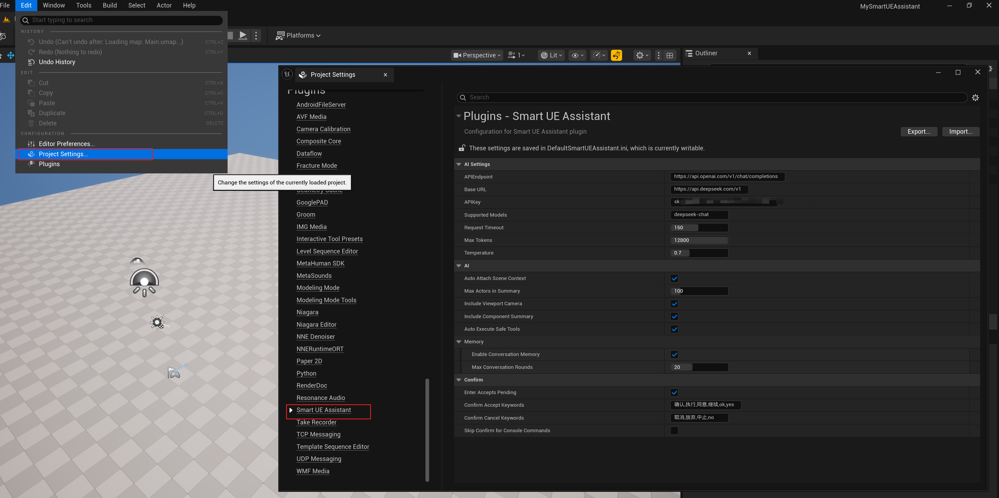
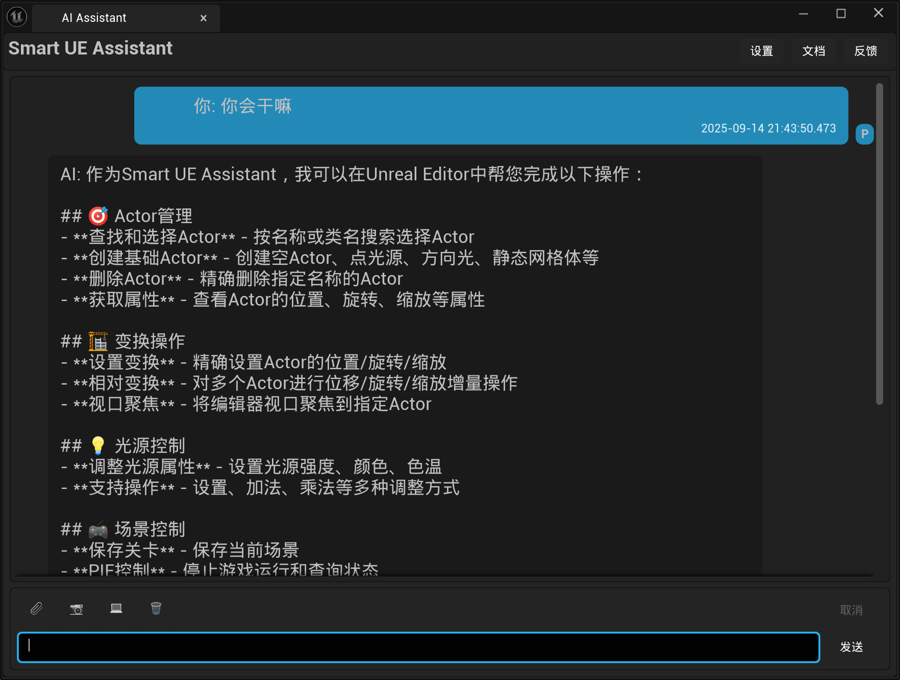
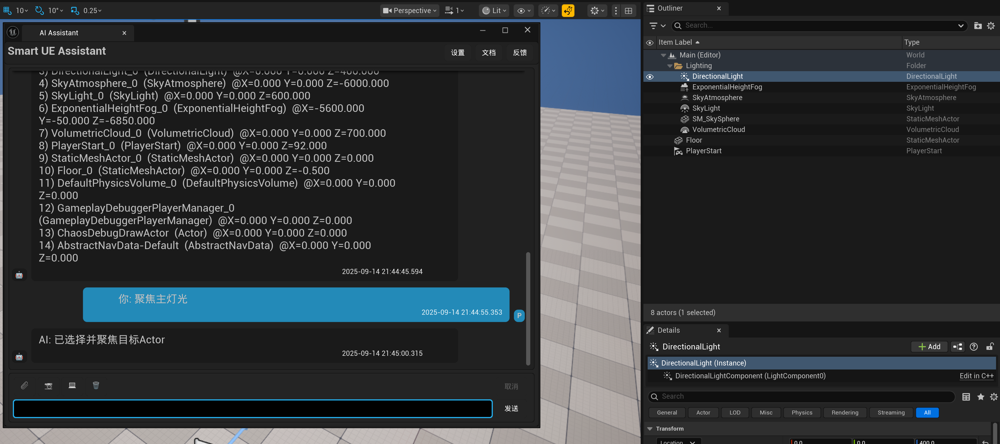
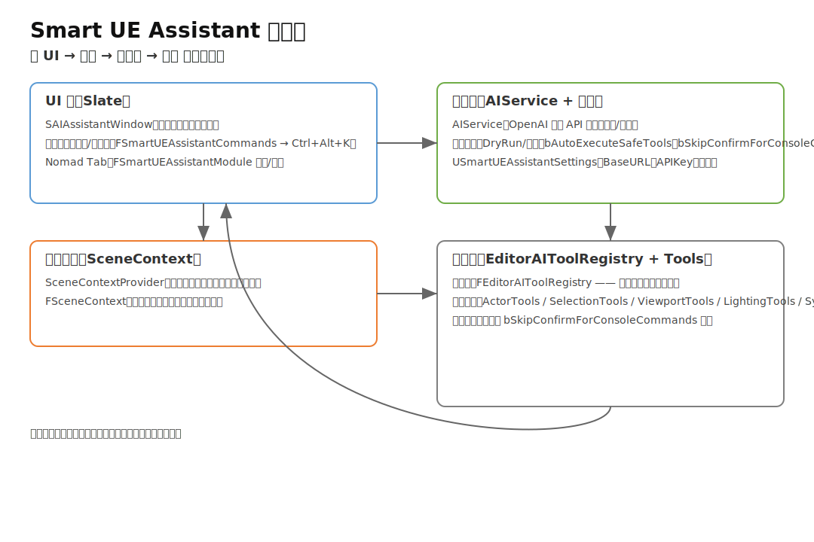

# Smart UE Assistant 插件

AI驱动的Unreal Engine智能助手插件，支持自然语言控制和代码生成。支持OpenAI和DeepSeek等兼容API。

## 目录

- [功能特性](#功能特性)
- [安装配置](#安装配置)
- [使用方法](#使用方法)
- [API 服务支持](#api-服务支持)
- [支持的功能](#支持的功能)
- [核心架构概览](#核心架构概览)
- [进一步阅读](#进一步阅读)
- [关键代码与目录](#关键代码与目录)
- [版本](#版本)
- [打包发布（脚本示例）](#打包发布脚本示例)
- [故障排查](#故障排查)
- [Roadmap（持续演进）](#roadmap持续演进)
- [数据流与执行流程（简述）](#数据流与执行流程简述)
- [扩展指南：新增一个自定义工具（示例）](#扩展指南新增一个自定义工具示例)
- [新增：上下文记忆与理解（离线本地方案）](#新增-上下文记忆与理解离线本地方案)
- [Roadmap 更新（离线记忆与检索）](#roadmap-更新离线记忆与检索)

## 功能特性

- 🤖 集成OpenAI兼容模型（OpenAI GPT、DeepSeek等）
- 💬 自然语言对话界面
- 🎯 UE编辑器指令执行
- ⚡ 实时代码生成
- 🎨 现代化Slate UI
- 🛡️ 可配置确认策略：仅危险工具需要确认（bAutoExecuteSafeTools）
- ⏭️ 跳过控制台命令确认（bSkipConfirmForConsoleCommands，1.0.6 新增）

## 安装配置

1. 启用插件：在插件管理器中启用 "Smart UE Assistant"
2. 配置 API 密钥：编辑 `Config/DefaultSmartUEAssistant.ini`
   - 将 `APIKey=your-api-key-here` 替换为您的 API 密钥
   - OpenAI 密钥: https://platform.openai.com/api-keys
   - DeepSeek 密钥: https://platform.deepseek.com/api_keys
3. 重启 UE 编辑器

## 使用方法

1. 菜单：Window → Smart UE Assistant

   
2. 输入自然语言指令

   
3. AI 将生成相应的 UE 代码或操作

   

## API 服务支持

### OpenAI

- 默认配置，使用 `https://api.openai.com`
- 支持模型：gpt-3.5-turbo, gpt-4

### DeepSeek

- 设置 `BaseURL=https://api.deepseek.com`
- 设置 `SupportedModels=deepseek-chat`
- 完全兼容 OpenAI API 格式

## 支持的功能

- 蓝图节点生成
- C++ 代码片段
- 编辑器操作自动化
- 问题解答和调试帮助

## 核心架构概览

<p align="center">
  
</p>

插件由“对话窗体 → AI服务 → 场景上下文 → 工具执行”四层组成，解耦清晰、易于扩展：

## 进一步阅读

- 更详细的模块职责、数据流、优化策略、测试策略等，请参阅：`Plugins/SmartUEAssistant/doc/SmartUEAssistant_FinalPlan.md` 的“技术架构确认/实施准备就绪”章节及“项目路线图”。
- 架构图资源：`Plugins/SmartUEAssistant/doc/architecture.svg`（文件将继续保留）。

---

- UI 层（对话与交互）
  - 入口与面板：Plugins/SmartUEAssistant/Source/SmartUEAssistant/Private/AIAssistantWindow.cpp（对应头文件在 Public/）
  - 样式与图标：…/Private/SmartUEAssistantStyle.cpp 与 …/Public/SmartUEAssistantStyle.h
- 服务层（模型调用与策略）
  - AIService：…/Private/AIService.cpp 与 …/Public/AIService.h，封装 OpenAI 兼容 API 调用、请求/响应序列化、执行策略（DryRun/确认）等
  - 设置项：…/Private/SmartUEAssistantSettings.cpp 与 …/Public/SmartUEAssistantSettings.h，提供 bAutoExecuteSafeTools、bSkipConfirmForConsoleCommands 等开关
- 上下文层（场景信息与环境）
  - 场景上下文：…/Private/SceneContextProvider.cpp 与 …/Public/SceneContextProvider.h，聚合 FSceneContext（…/Public/FSceneContext.h）
- 工具层（能力与动作）
  - 工具目录：…/Private/Tools/*.cpp 与 …/Public/Tools/*.h，包含 ActorTools、SelectionTools、ViewportTools、LightingTools、SystemTools、QueryTools
  - 工具注册与类型：…/Public/EditorAIToolRegistry.h、…/Public/EditorAIToolTypes.h

## 关键代码与目录

- 模块入口：Plugins/SmartUEAssistant/Source/SmartUEAssistant/Private/SmartUEAssistant.cpp
- 构建文件：Plugins/SmartUEAssistant/Source/SmartUEAssistant/SmartUEAssistant.Build.cs
- 对话窗体：Plugins/SmartUEAssistant/Source/SmartUEAssistant/Private/AIAssistantWindow.cpp
- AI 服务：Plugins/SmartUEAssistant/Source/SmartUEAssistant/Private/AIService.cpp
- 设置定义：Plugins/SmartUEAssistant/Source/SmartUEAssistant/Public/SmartUEAssistantSettings.h
- 场景上下文：Plugins/SmartUEAssistant/Source/SmartUEAssistant/Private/SceneContextProvider.cpp
- 工具清单：
  - ActorTools：…/Private/Tools/ActorTools.cpp（放置/移动/删除等Actor相关）
  - SelectionTools：…/Private/Tools/SelectionTools.cpp（选择相关）
  - ViewportTools：…/Private/Tools/ViewportTools.cpp（视口与相机）
  - LightingTools：…/Private/Tools/LightingTools.cpp（灯光与环境）
  - SystemTools：…/Private/Tools/SystemTools.cpp（控制台命令等系统操作）
  - QueryTools：…/Private/Tools/QueryTools.cpp（查询/统计）

## 版本

- 当前版本：1.0.8（插件元数据：Version=10008, VersionName=1.0.8，见 Plugins/SmartUEAssistant/SmartUEAssistant.uplugin）
- 变更对比：v1.0.7…v1.0.8 — https://github.com/xlostpanda/MySmartUEAssistant/compare/v1.0.7...v1.0.8
- Release：v1.0.8 — https://github.com/xlostpanda/MySmartUEAssistant/releases/tag/v1.0.8

## 打包发布（脚本示例）

使用根目录下的 PowerShell 脚本一键打包插件，默认产物位于 dist/。

- 脚本位置：Scripts/PackSmartUEAssistantPlugin.ps1
- 产物命名：dist/SmartUEAssistant_<version>.zip（ZIP 根目录即 SmartUEAssistant/）

示例：

1) 默认版本（从 .uplugin 自动读取），输出到 dist

```powershell
# 在仓库根目录执行
./Scripts/PackSmartUEAssistantPlugin.ps1
```

2) 指定版本与输出目录

```powershell
./Scripts/PackSmartUEAssistantPlugin.ps1 -Version 1.0.7 -OutputRoot out
```

3) 输出详细日志

```powershell
./Scripts/PackSmartUEAssistantPlugin.ps1 -VerboseLog
```

版本默认化说明：

- 未显式传入 -Version 时，脚本会按顺序尝试：
  1) 读取 Plugins/SmartUEAssistant/SmartUEAssistant.uplugin 的 VersionName
  2) 若无则读取 Version
  3) 均无则回退到时间戳（yyyyMMdd-HHmm）
- 版本字符串会被清洗以适配文件名：使用正则 [^0-9A-Za-z._-] 替换为下划线 "_"。

关键行为要点：

- 使用 robocopy 复制插件目录，排除 .git、Intermediate、Saved、.vs，以及 *.obj、*.pdb、*.ipdb、*.iobj、*.tmp 等临时产物。
- 强制校验 staging 中存在 Config 目录，缺失将中止并报错。
- 使用 System.IO.Compression.ZipFile 生成压缩包，ZIP 根包含 SmartUEAssistant/。

1. API 密钥未生效：确认已在 `Config/DefaultSmartUEAssistant.ini` 写入并重启编辑器。
2. 无法访问服务：检查网络代理、BaseURL 与模型名称。
3. 执行策略不符合预期：检查上述两个设置项是否按需开启/关闭。

---

*支持 OpenAI 兼容 API 服务：OpenAI、DeepSeek 等*

## Roadmap（持续演进）

- 工具体系
  - [ ]  更多编辑器内置工具能力（资产批处理、关卡切换、材质替换）
  - [ ]  工具能力权限分级与安全沙箱
- 模型与推理
  - [ ]  增加多模型路由与降级策略（离线/网络异常回退）
  - [ ]  支持流式响应与中断控制
- 交互与体验
  - [ ]  对话持久化与多会话管理
  - [ ]  提示词模板与上下文拼装可视化
- 开放与扩展
  - [ ]  自定义工具模板脚手架命令（生成 .h/.cpp）
  - [ ]  工具市场/插件化加载

欢迎通过 Issues/PR 反馈与共建。

## 数据流与执行流程（简述）

1) 用户输入指令（UI 层 AIAssistantWindow）
   - 采集上下文（当前关卡、选择集、项目设置）并转为 FSceneContext
2) 生成与发送请求（服务层 AIService）
   - 组织 Prompt + 工具清单（EditorAIToolRegistry）+ 执行策略（DryRun/确认/跳过控制台确认）
   - 调用 OpenAI 兼容 API，流式/非流式接收模型回复
3) 解析模型回复（AIService）
   - 将回复映射为“工具调用计划”（ToolName + 参数）或“自然语言建议”
4) 执行与回传（工具层 + UI）
   - 当需确认：返回预览与风险提示；用户点击确认后执行
   - 当可直接执行：工具模块（如 ActorTools/SelectionTools 等）完成具体操作
   - UI 展示结果/日志，必要时给出回滚/二次确认

## 扩展指南：新增一个自定义工具（示例）

目标：添加一个“批量重命名选中Actor”的工具

- 1. 定义工具接口（Public/Tools/MyRenameTools.h）

  ```cpp
  // 伪代码，仅示意
  struct FMyRenameParams { FString Prefix; int32 StartIndex = 1; };
  class FMyRenameTools {
  public:
    static bool BatchRenameSelected(const FMyRenameParams& Params, FString& OutLog);
  };
  ```
- 2. 实现工具逻辑（Private/Tools/MyRenameTools.cpp）

  ```cpp
  // 伪代码：遍历当前选择集并重命名
  bool FMyRenameTools::BatchRenameSelected(const FMyRenameParams& Params, FString& OutLog) {
    // 获取选择集 → 拼接新名称 → 设置名称 → 汇总日志
    return true;
  }
  ```
- 3. 注册到工具清单（Public/EditorAIToolRegistry.h）

  - 声明一个 ToolId（如 "BatchRenameSelected"）与参数规范
  - 指定安全级别：是否需要确认（危险/只读/系统）
- 4. 在 AIService 的提示词/工具说明中加入该工具

  - 确保模型能“看见”新工具与参数格式
- 5. 验证

  - 关闭确认：应直接执行；
  - 开启确认：应先返回预览，确认后执行；
  - 控制台类命令不受此工具影响（与 bSkipConfirmForConsoleCommands 无关）

---

## 新增：上下文记忆与理解（离线本地方案）

目标：在完全离线、中文优先（兼顾英文）的前提下，提供“分层记忆→检索→规划→执行→反思”的稳健能力，提升正确率、长期一致性与可解释性。

### 分层记忆模型

- 短期/工作记忆：最近K轮对话与活跃对象缓存（内存+环形缓存，必要时落盘）。
- 情景记忆：会话/任务级的约定、决策、错误-修复、关键链接（SQLite+FTS5全文索引）。
- 长期语义记忆：稳定事实与文档切片（本地向量索引：FAISS 或 Chroma）。

### 本地存储与索引

- 元数据与全文：SQLite（含FTS5）。
- 向量检索：优先FAISS-CPU（纯离线），可选Chroma；均在本地文件中运行。
- 嵌入模型：bge-small-zh-v1.5（中文优先，兼顾英文）或复用现有Embedding能力。

### 检索与规划流水线

- 多路召回：STM/情景/长期记忆混合检索（BM25/FTS+向量），证据Top-K合并。
- 重排与压缩：语义分数+时间衰减+重要度融合；摘要压缩以适配上下文。
- 代理策略：
  - ReAct：推理-行动交替，适合工具执行与检索问答。
  - Tree of Thoughts：复杂任务进行多路径探索与自评，控制搜索预算。
  - Reflexion：基于语言反馈的自我反思，写回“反思记忆”。
- 证据溯源：默认要求回答附带证据或给出“依据不足”的提示。

参考：RAG 模型将检索作为非参数记忆与生成结合，并在知识密集任务上优于仅参数模型。<mcreference link="https://arxiv.org/abs/2005.11401" index="1">1</mcreference> <mcreference link="https://arxiv.org/abs/2005.11401v4" index="3">3</mcreference>

### 安全与隐私

- 记忆分区（私有/会话/团队），严格权限标签；工具危险级与二次确认；一键清除与导出。

### 第一阶段（UE 快捷工具范围）

- 仅覆盖“最常用核心”编辑器操作（对现有工具的包装与统一入口）：
  - 选择与批量操作（SelectionTools）
  - 视口/相机（ViewportTools）
  - Actor常见操作（ActorTools：放置/移动/重命名/删除）
  - 控制台命令快捷调用（SystemTools，遵守 bSkipConfirmForConsoleCommands）
  - 场景查询（QueryTools）
- 提供“命令面板”入口（面板内统一搜索与执行），暂不引入托盘/侧边栏/片段库等非核心能力。

---

## Roadmap 更新（离线记忆与检索）

- [ ]  本地记忆存储适配层（SQLite+FTS5，FAISS/Chroma 二选一）
- [ ]  多路检索与重排（BM25/FTS+向量混检）
- [ ]  代理策略与可配置搜索预算（ReAct/ToT/Reflexion）
- [ ]  证据化回答与可审计日志
- [ ]  UE 最常用快捷工具命令面板（统一入口）
- [ ]  多会话与记忆清理/导出

注：后续按Git规范走 `docs` 类提交，分支：`roadmap-上下文方案`。
